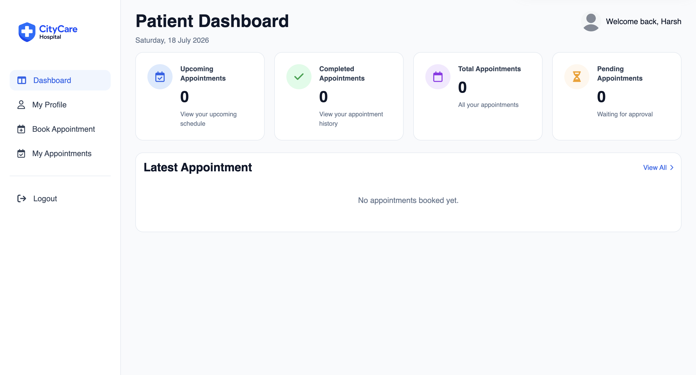
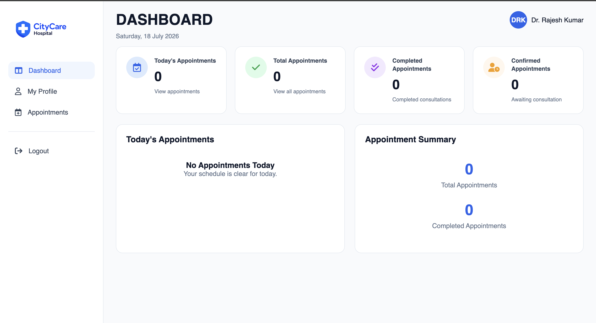
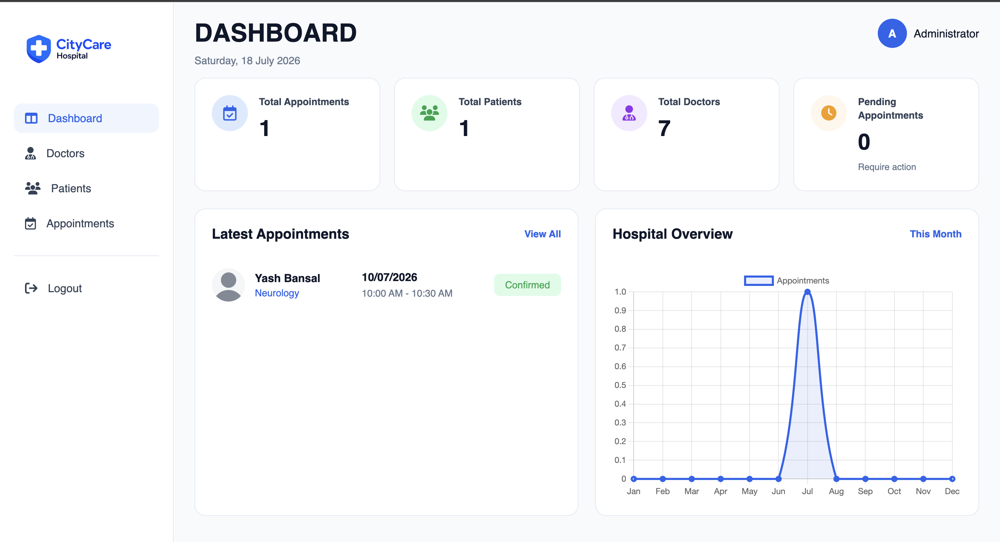

# 🏥 Hospital Management System

A full-stack **Hospital Management System** developed using **HTML, CSS, JavaScript, Node.js, Express.js, and MongoDB**. The system provides separate portals for **Patients, Doctors, and Administrators**, enabling efficient hospital management through secure authentication, appointment scheduling, and role-based access.

---

## 🚀 Features

### 👤 Patient Module
- Patient Registration & Login
- Secure Authentication
- Dashboard with Appointment Statistics
- Book Appointments
- View & Manage Appointments
- Update Patient Profile

### 👨‍⚕️ Doctor Module
- Doctor Login
- Doctor Dashboard
- Manage Upcoming Appointments
- View Patient Details
- Update Doctor Profile

### 🛡️ Admin Module
- Admin Login
- Dashboard Overview
- Manage Doctors
- Manage Patients
- Manage Appointments
- Add, Edit & Delete Doctor Records

### 🌐 Homepage
- Responsive Landing Page
- Dynamic Doctor Listing
- Services Section
- Contact Form
- Privacy Policy
- Terms & Conditions

---

---

## 📸 Screenshots

### 🏠 Homepage


---

### 👤 Patient Dashboard



---

### 👨‍⚕️ Doctor Dashboard



---

### 🛡️ Admin Dashboard



---

## ✨ Additional Features

- Role-Based Authentication
- JWT Authentication
- Password Hashing using bcryptjs
- MongoDB Database Integration
- RESTful APIs
- Responsive Design
- Custom Toast Notifications
- Custom Confirmation Modals
- Animated Statistics
- Automatic Doctor Slider
- Form Validation
- Protected Routes

---

## 🛠️ Tech Stack

### Frontend
- HTML5
- CSS3
- JavaScript (ES6)

### Backend
- Node.js
- Express.js

### Database
- MongoDB
- Mongoose

### Authentication
- JSON Web Token (JWT)
- bcryptjs

### Other Tools
- Multer
- Cloudinary
- CORS
- dotenv

---

## 📂 Project Structure

```
Hospital-Management-System
│
├── assets
│
├── BACKEND
│   ├── config
│   ├── controllers
│   ├── middlewares
│   ├── models
│   ├── routes
│   ├── uploads
│   ├── utils
│   ├── server.js
│   └── package.json
│
├── FRONTEND
│   ├── admin
│   ├── doctor
│   ├── patient
│   ├── homepage
│   ├── policy&TC
│   ├── confirm-toast
│   └── config.js
│
├── README.md
└── .gitignore
```

---

## ⚙️ Installation

### Clone Repository

```bash
git clone https://github.com/yashkumar1907/Hospital-Management-System.git
```

### Go to Backend

```bash
cd Hospital-Management-System/BACKEND
```

### Install Dependencies

```bash
npm install
```

### Create Environment File

Create a `.env` file inside the `BACKEND` folder.

Example:

```env
PORT=5000
MONGO_URI=your_mongodb_connection_string
JWT_SECRET=your_secret_key
EMAIL=your_email
PASSWORD=your_email_password
```

### Start Backend

```bash
npm start
```

or

```bash
npm run dev
```

### Open Frontend

Open

```
FRONTEND/homepage/homepage.html
```

using Live Server or any local server.

---


## 📌 Future Enhancements

- Online Payment Integration
- Email Appointment Reminders
- SMS Notifications
- Medical Report Upload
- Video Consultation
- Prescription Management
- Admin Analytics Dashboard
- Doctor Availability Calendar

---

## 👨‍💻 Author

**Yash Kumar**

GitHub: https://github.com/yashkumar1907

---

## 📄 License

This project is developed for educational and learning purposes.