# 🏥 Hospital Management System

<p align="center">
  <h3 align="center">A Full Stack Hospital Management System</h3>

  <p align="center">
    Built using <strong>HTML, CSS, JavaScript, Node.js, Express.js, MongoDB Atlas, JWT Authentication, Cloudinary, and REST APIs</strong>.
    <br/>
    A secure, responsive, and role-based web application designed to simplify hospital operations by providing dedicated portals for <strong>Patients</strong>, <strong>Doctors</strong>, and <strong>Administrators</strong>.
  </p>
</p>

---

<p align="center">


</p>

<p align="center">


</p>

---

## 🌐 Live Demo

**Frontend:** https://your-frontend-url

**Backend API:** https://your-backend-url

> **Note:** Replace the above URLs with your deployed Render frontend and backend URLs.

---

# 📌 Overview

The **Hospital Management System** is a full-stack web application developed to streamline hospital operations through a secure and user-friendly platform.

The application follows a **Role-Based Access Control (RBAC)** architecture and provides three independent portals for:

- 👤 Patients
- 👨‍⚕️ Doctors
- 🛡️ Administrators

Patients can register, manage their profiles, book appointments, and track appointment status.

Doctors can manage their professional profiles, generate appointment slots, control slot availability, and view approved appointments.

Administrators have complete control over doctors, patients, appointments, and the approval workflow, ensuring that appointments are reviewed before becoming visible to doctors.

The backend is developed using **Node.js**, **Express.js**, and **MongoDB Atlas**, while the frontend is built using **HTML**, **CSS**, and **JavaScript** with RESTful API communication.

---

# 🚀 Key Highlights

- 🔐 JWT Authentication
- 👥 Role-Based Access Control (RBAC)
- 🏥 Separate Portals for Patient, Doctor & Admin
- 📅 Doctor Slot Generation & Management
- ✅ Appointment Approval Workflow
- ☁️ Cloudinary Image Upload Integration
- 📂 MongoDB Atlas Database
- 🔄 RESTful API Architecture
- 📱 Fully Responsive Design
- 🔔 Custom Toast Notification System
- ❓ Custom Confirmation Dialog System
- 🛡️ Protected Routes & Secure Authentication
- 📊 Interactive Dashboard Statistics
- 🖼️ Dynamic Profile Image Management
- ⚡ Real-Time CRUD Operations
- 🚀 Deployed Backend & Frontend

---

# ⭐ Project Highlights

✔ Full Stack Web Development

✔ REST API Development

✔ JWT Authentication

✔ Role-Based Authorization

✔ MongoDB Atlas Integration

✔ Cloudinary Image Upload

✔ Appointment Booking Workflow

✔ Doctor Slot Management

✔ Multi-Role Dashboard System

✔ CRUD Operations

✔ Responsive User Interface

✔ Production Deployment

---

# 🎯 Why This Project?

This project demonstrates the implementation of a real-world Hospital Management System by integrating frontend development, backend APIs, database management, authentication, file uploads, and role-based authorization into a single full-stack application.

It showcases practical software engineering concepts including:

- Full Stack Development
- RESTful API Design
- Authentication & Authorization
- Database Modeling
- File Upload Management
- CRUD Operations
- Responsive UI Development
- Deployment & Production Configuration

---


# ✨ Features

The Hospital Management System provides dedicated portals for **Patients**, **Doctors**, and **Administrators**, ensuring secure and efficient hospital management through role-based access.

---

# 👤 Patient Module

The Patient Portal allows patients to manage appointments, personal information, and healthcare records through an intuitive dashboard.

## 🔐 Authentication

- Patient Registration
- Secure Login
- JWT Authentication
- Protected Routes
- Secure Logout

---

## 📊 Dashboard

- Personalized Welcome Dashboard
- Appointment Statistics
- Upcoming Appointment Count
- Completed Appointment Count
- Pending Appointment Count
- Latest Appointment Summary

---

## 👤 Profile Management

- View Personal Information
- Update Profile Details
- Upload Profile Picture
- Update Contact Information
- Manage Emergency Contact
- Manage Allergies
- Manage Medical History

---

## 📅 Appointment Management

- Browse Available Doctors
- View Doctor Information
- Book Appointments
- Select Appointment Date
- Choose Available Time Slots
- Add Appointment Notes
- View Appointment History
- Track Appointment Status
- View Doctor Profile Photo

---

# 👨‍⚕️ Doctor Module

The Doctor Portal enables doctors to manage their availability, appointments, and professional information.

## 🔐 Authentication

- Secure Login
- JWT Protected Routes
- Secure Logout

---

## 📊 Dashboard

- Personalized Dashboard
- Appointment Overview
- Upcoming Appointment Summary
- Professional Information

---

## 👨‍⚕️ Profile Management

- View Professional Profile
- Update Profile Information
- Upload Profile Picture
- Update Contact Details

---

## ⏰ Slot Management

- Generate Daily Appointment Slots
- View Generated Slots
- Prevent Duplicate Slot Generation
- Block Appointment Slots
- Unblock Appointment Slots
- Track Slot Availability
- Real-time Slot Updates

---

## 📅 Appointment Management

- View Approved Appointments
- View Patient Details
- Track Appointment Status
- Appointment Summary

---

# 🛡️ Admin Module

The Administrator Portal provides complete control over the Hospital Management System.

## 📊 Dashboard

- Hospital Statistics
- Doctor Statistics
- Patient Statistics
- Appointment Statistics

---

## 👨‍⚕️ Doctor Management

- Add New Doctors
- Update Doctor Information
- Upload Doctor Profile Picture
- Delete Doctors
- Prevent Deletion of Doctors with Appointment History
- Manage Doctor Availability

---

## 👤 Patient Management

- View Registered Patients
- Delete Patients
- Prevent Deletion of Patients with Appointment History

---

## 📅 Appointment Management

- View All Appointments
- Approve Appointments
- Reject Appointments
- Monitor Appointment Status
- Complete Appointment Approval Workflow

---

# 🌐 Homepage

The homepage provides visitors with hospital information and services through a modern, responsive interface.

### Features

- Responsive Landing Page
- Hero Section
- About Hospital
- Hospital Services
- Dynamic Doctor Listing
- Automatic Doctor Slider
- Contact Form
- Privacy Policy
- Terms & Conditions
- Responsive Navigation

---

# 🔒 Authentication & Security

The application follows secure authentication and authorization practices.

- JWT Authentication
- Role-Based Access Control (RBAC)
- Protected API Routes
- Authentication Middleware
- Role Authorization Middleware
- Password Hashing using bcryptjs
- Secure Password Storage
- Cloudinary Image Upload
- Input Validation
- Global Error Handling

---

# 📅 Appointment Workflow

The appointment system follows a real-world hospital approval process.

```text
                  👤 Patient
                      │
                      ▼
            Book Appointment
                      │
                      ▼
         Appointment Created (Pending)
                      │
                      ▼
              🛡️ Administrator
                      │
          ┌───────────┴───────────┐
          ▼                       ▼
     Approve                  Reject
          │
          ▼
    👨‍⚕️ Doctor Dashboard
          │
          ▼
     Patient Consultation
          │
          ▼
   Appointment Completed
```

---

# ⭐ Additional Features

- RESTful API Architecture
- MongoDB Atlas Integration
- Cloudinary Image Upload
- Dynamic Dashboard Statistics
- Automatic Image Fallback
- Custom Toast Notifications
- Custom Confirmation Dialogs
- Responsive User Interface
- Client-side Form Validation
- Backend Validation
- Loading Indicators
- Empty State Screens
- Persistent Login Sessions
- Refresh-safe Authentication
- Secure CRUD Operations
- Modular Folder Structure
- Production-ready Backend Architecture

---


# 📸 Screenshots

The following screenshots provide an overview of the different modules and functionalities available in the Hospital Management System.

---

## 🏠 Homepage

A modern and responsive landing page featuring hospital information, services, specialist doctors, and a contact section.

<p align="center">
    
</p>

---

## 👤 Patient Dashboard

Personalized dashboard displaying appointment statistics, latest appointment details, and quick navigation options.

<p align="center">
    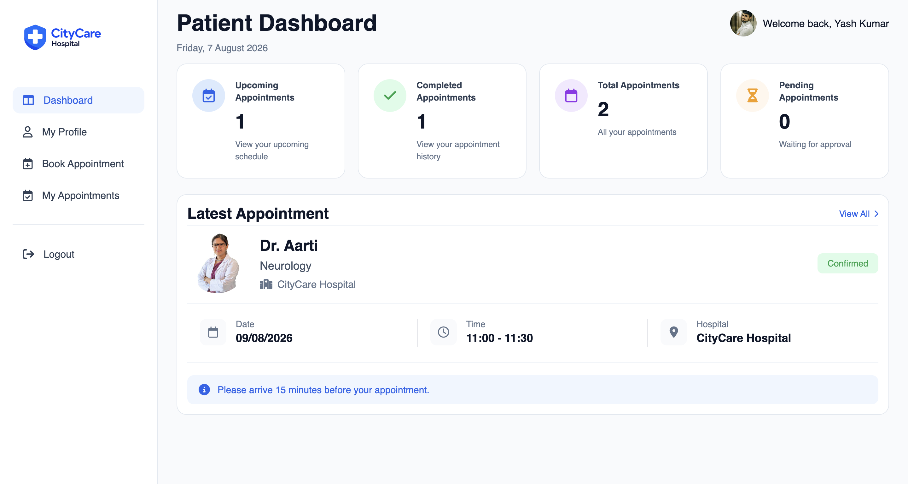
</p>

---

## 👤 Patient Profile

Patients can update personal information, upload profile pictures, manage emergency contacts, allergies, and medical history.

<p align="center">
    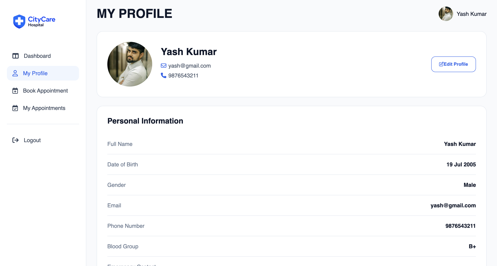
</p>

---

## 📅 Book Appointment

Patients can browse available doctors, select appointment dates, choose available time slots, and submit appointment requests.

<p align="center">
    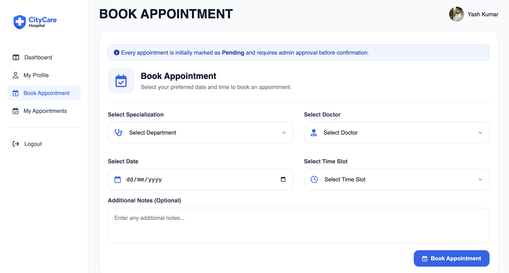
</p>

---

## 📋 Patient Appointments

Displays complete appointment history with appointment status, doctor information, and consultation details.

<p align="center">
    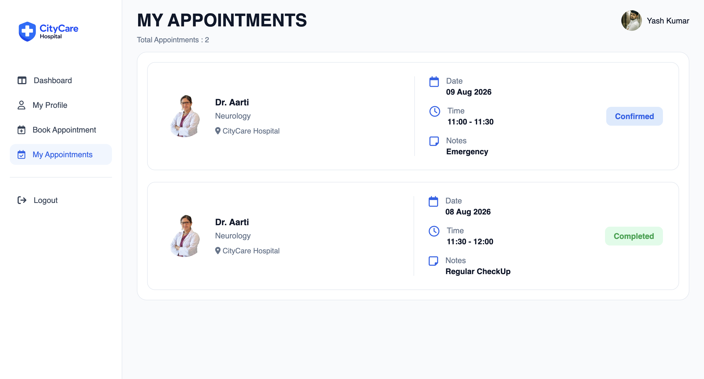
</p>

---

## 👨‍⚕️ Doctor Dashboard

Provides appointment statistics, profile overview, and quick access to slot management.

<p align="center">
    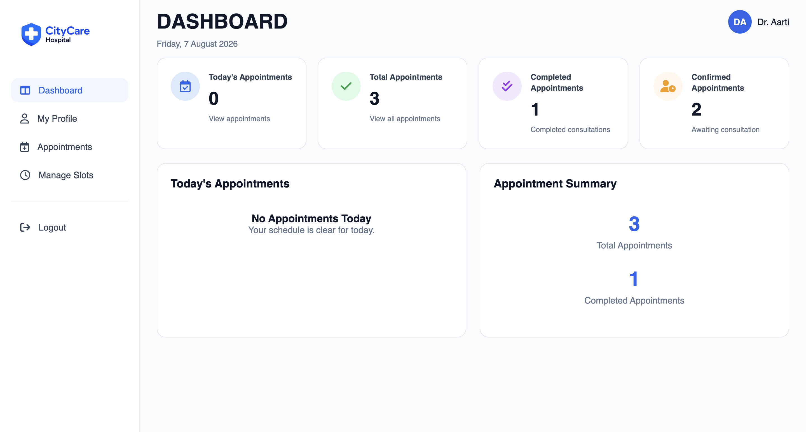
</p>

---

## 👨‍⚕️ Doctor Profile

Doctors can update professional details, contact information, and profile images.

<p align="center">
    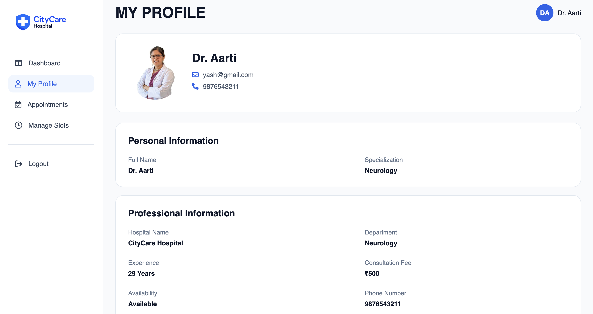
</p>

---

## ⏰ Doctor Slot Management

Doctors can generate appointment slots, block or unblock slots, and monitor slot availability.

<p align="center">
    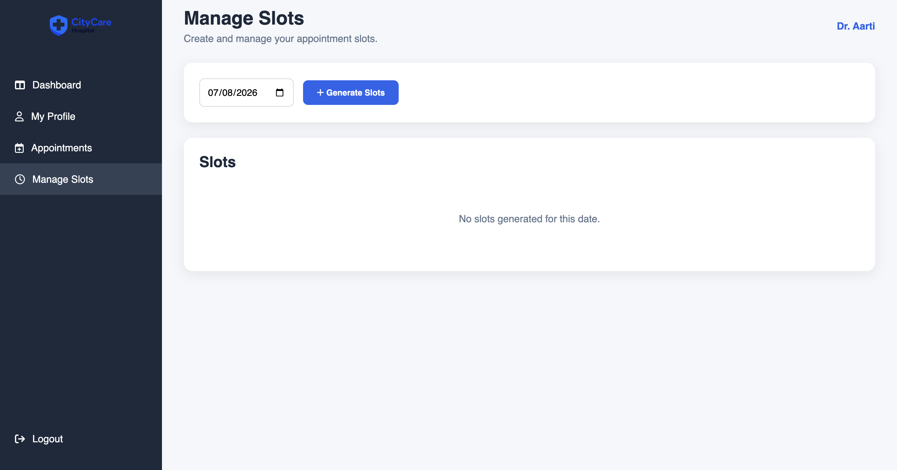
</p>

---

## 📅 Doctor Appointments

Displays all approved appointments assigned to the doctor.

<p align="center">
    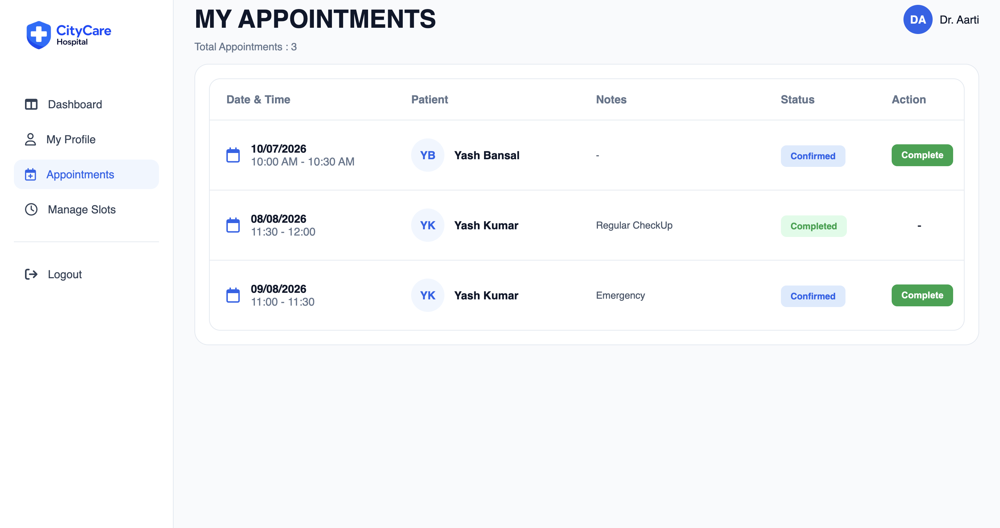
</p>

---

## 🛡️ Admin Dashboard

Provides an overview of hospital activities including doctors, patients, and appointments.

<p align="center">
    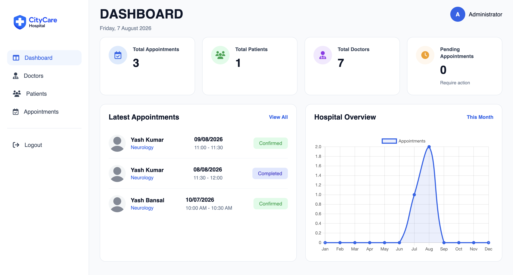
</p>

---

## 👨‍⚕️ Manage Doctors

Administrators can add, edit, update, delete, and manage doctor records.

<p align="center">
    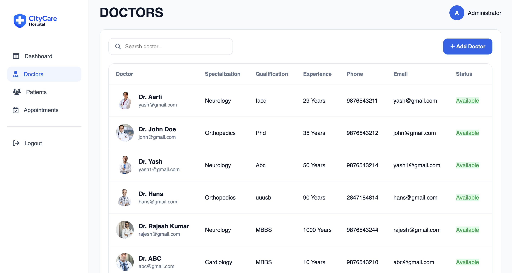
</p>

---

## 👤 Manage Patients

Administrators can view registered patients and manage patient records.

<p align="center">
    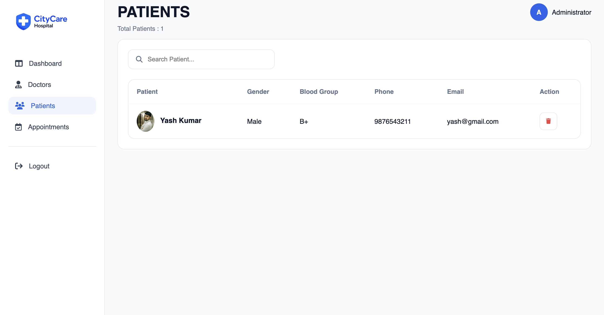
</p>

---

## 📋 Manage Appointments

Administrators can approve or reject appointments and monitor their current status.

<p align="center">
    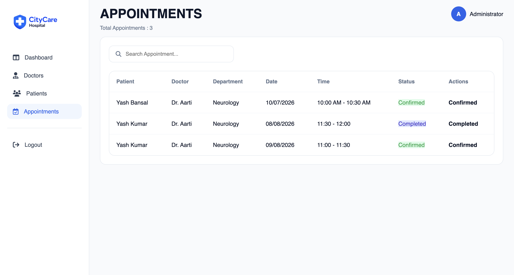
</p>

---

# 🛠️ Technology Stack

## 🎨 Frontend

- HTML5
- CSS3
- JavaScript (ES6)
- Fetch API

---

## ⚙️ Backend

- Node.js
- Express.js

---

## 🗄️ Database

- MongoDB Atlas
- Mongoose

---

## 🔐 Authentication & Security

- JWT (JSON Web Token)
- bcryptjs
- Role-Based Access Control (RBAC)

---

## ☁️ File Upload & Storage

- Multer
- Cloudinary

---

## 🚀 Deployment

- Render
- GitHub

---

## 🧰 Development Tools

- Visual Studio Code
- Git
- GitHub
- Postman / Hoppscotch

---

# 🏗️ System Architecture

```text
                    👤 Patient
                   👨‍⚕️ Doctor
                  🛡️ Administrator
                         │
                         ▼
        Frontend (HTML • CSS • JavaScript)
                         │
                  REST API (Fetch)
                         │
                         ▼
             Node.js + Express.js Backend
                         │
          ┌──────────────┴──────────────┐
          ▼                             ▼
 MongoDB Atlas                  Cloudinary
(Database Storage)             (Image Storage)
```

---

# 📂 Project Structure

```text
Hospital-Management-System
│
├── BACKEND
│   ├── config
│   ├── controllers
│   ├── middlewares
│   ├── models
│   ├── routes
│   ├── utils
│   ├── server.js
│   ├── package.json
│   └── .env
│
├── FRONTEND
│   ├── admin
│   ├── doctor
│   ├── patient
│   ├── homepage
│   ├── policy&TC
│   ├── confirm-toast
│   ├── assets
│   ├── config.js
│   └── index.html
│
├── screenshots
│   ├── homepage.png
│   ├── patient-dashboard.png
│   ├── patient-profile.png
│   ├── patient-book-appointment.png
│   ├── patient-appointments.png
│   ├── doctor-dashboard.png
│   ├── doctor-profile.png
│   ├── doctor-slots.png
│   ├── doctor-appointments.png
│   ├── admin-dashboard.png
│   ├── admin-doctors.png
│   ├── admin-patients.png
│   └── admin-appointments.png
│
├── README.md
└── .gitignore
```

---


# ⚙️ Installation Guide

Follow the steps below to set up the Hospital Management System on your local machine.

---

# 📋 Prerequisites

Before running the project, make sure the following software is installed:

- Node.js (v20 or later)
- npm
- MongoDB Atlas Account
- Cloudinary Account
- Git
- Visual Studio Code (Recommended)

---

# 📥 Clone the Repository

Clone the repository from GitHub.

```bash
git clone https://github.com/yashkumar1907/Hospital-Management-System.git
```

Move into the project directory.

```bash
cd Hospital-Management-System
```

---

# ⚙️ Backend Setup

Navigate to the backend directory.

```bash
cd BACKEND
```

Install all required dependencies.

```bash
npm install
```

---

# 🔑 Configure Environment Variables

Create a `.env` file inside the **BACKEND** directory.

Example:

```env
PORT=

MONGO_URI=

JWT_SECRET=

CLOUDINARY_CLOUD_NAME=

CLOUDINARY_API_KEY=

CLOUDINARY_API_SECRET=
```

> **Important:** Never upload your `.env` file or expose sensitive credentials in a public repository.

---

# ▶️ Start the Backend Server

### Development Mode

```bash
npm run dev
```

### Production Mode

```bash
npm start
```

If everything is configured correctly, the terminal should display something similar to:

```text
MongoDB Connected Successfully

🚀 HMS Backend running on port 5000

Environment: development
```

---

# 💻 Frontend Setup

The frontend is built using **HTML, CSS, and JavaScript**.

Open the project using **Visual Studio Code**.

Launch the homepage using **Live Server**.

```text
FRONTEND/homepage/homepage.html
```

The application is now ready to use.

---

# 🚀 Deployment

The project is deployed using **Render**.

## Backend

- Node.js Runtime
- Express.js Server
- MongoDB Atlas
- Cloudinary Integration
- Environment Variables
- Automatic GitHub Deployment

---

## Frontend

The frontend can be deployed using any static hosting service such as:

- Render Static Site
- GitHub Pages
- Netlify
- Vercel

---

# 🌍 Environment Variables

The backend requires the following environment variables.

| Variable | Description |
|----------|-------------|
| `PORT` | Backend Server Port |
| `MONGO_URI` | MongoDB Atlas Connection String |
| `JWT_SECRET` | Secret Key for JWT Authentication |
| `CLOUDINARY_CLOUD_NAME` | Cloudinary Cloud Name |
| `CLOUDINARY_API_KEY` | Cloudinary API Key |
| `CLOUDINARY_API_SECRET` | Cloudinary API Secret |

---

# ▶️ Running the Application

## Start Backend

```bash
cd BACKEND

npm install

npm run dev
```

---

## Start Frontend

Launch:

```text
FRONTEND/homepage/homepage.html
```

using **Live Server**.

---

# 👥 User Roles

The application provides three independent user portals.

## 👤 Patient

Patients can:

- Register
- Login
- Manage Profile
- Upload Profile Picture
- Book Appointments
- View Appointment History
- Track Appointment Status

---

## 👨‍⚕️ Doctor

Doctors can:

- Login
- Update Professional Profile
- Upload Profile Picture
- Generate Appointment Slots
- Block / Unblock Slots
- View Approved Appointments

---

## 🛡️ Administrator

Administrators can:

- Manage Doctors
- Manage Patients
- Approve Appointments
- Reject Appointments
- Monitor Hospital Statistics

---

# 📡 REST API Architecture

The backend follows a **RESTful API** architecture.

## Authentication

- Patient Authentication
- Doctor Authentication
- Admin Authentication

---

## Patient APIs

- Registration
- Login
- Profile Management
- Appointment Booking
- Appointment History

---

## Doctor APIs

- Login
- Profile Management
- Appointment Management

---

## Doctor Slot APIs

- Generate Slots
- View Slots
- Block Slots
- Unblock Slots
- Available Slot Listing

---

## Admin APIs

- Dashboard
- Doctor Management
- Patient Management
- Appointment Approval

---

## Contact API

- Contact Form Submission

---

# 📂 Database Collections

The application stores data in the following MongoDB collections.

- Admin
- Patient
- Doctor
- Appointment
- DoctorSlot
- ContactMessage

Each collection is managed using **Mongoose Models**, ensuring clean schema design and efficient database operations.

---

# 🔒 Security Features

The Hospital Management System follows secure development practices to protect user data and ensure controlled access across different user roles.

## 🔐 Authentication & Authorization

- JWT (JSON Web Token) Authentication
- Role-Based Access Control (RBAC)
- Protected Routes
- Authentication Middleware
- Authorization Middleware
- Secure Logout

---

## 🔑 Password Security

- Password Hashing using **bcryptjs**
- Plain Text Passwords are Never Stored
- Secure Password Verification during Login

---

## ☁️ Secure File Uploads

- Cloudinary Image Storage
- Multer File Upload Middleware
- Image Type Validation
- Image Size Validation
- Default Profile Image Fallback

---

## 🛡️ Backend Security

- Global Error Handling
- Invalid Route Handling (404)
- Environment Variable Configuration
- CORS Configuration
- MongoDB Input Validation
- Protected API Endpoints

---

# 🏗️ Software Engineering Concepts

This project demonstrates practical implementation of several important software engineering concepts.

## Backend Development

- RESTful API Development
- MVC (Model-View-Controller) Architecture
- Modular Folder Structure
- Middleware-Based Authentication
- Environment Variable Management
- Error Handling

---

## Database Design

- MongoDB Atlas Integration
- Mongoose ODM
- Relational References using ObjectId
- CRUD Operations
- Data Validation

---

## Frontend Development

- Responsive User Interface
- Fetch API Integration
- Dynamic DOM Manipulation
- Client-side Form Validation
- Modular JavaScript
- Image Preview Functionality

---

## Authentication

- JWT Authentication
- Protected Routes
- Role-Based Authorization
- Session Persistence
- Secure Logout Handling

---

# 🧪 Testing Summary

The project has been manually tested across all major modules to ensure functionality and reliability.

| Module | Status |
|---------|:------:|
| Homepage | ✅ |
| Contact Form | ✅ |
| Patient Registration | ✅ |
| Patient Login | ✅ |
| Patient Dashboard | ✅ |
| Patient Profile | ✅ |
| Appointment Booking | ✅ |
| Appointment History | ✅ |
| Doctor Dashboard | ✅ |
| Doctor Profile | ✅ |
| Doctor Slot Generation | ✅ |
| Slot Blocking / Unblocking | ✅ |
| Doctor Appointments | ✅ |
| Admin Dashboard | ✅ |
| Doctor CRUD | ✅ |
| Patient CRUD | ✅ |
| Appointment Approval | ✅ |
| Image Upload | ✅ |
| JWT Authentication | ✅ |
| Route Protection | ✅ |
| MongoDB Persistence | ✅ |
| Responsive Design | ✅ |
| Deployment | ✅ |

---

# 🚀 Future Enhancements

The project can be further enhanced by implementing additional real-world healthcare features.

- 💳 Online Payment Gateway
- 📧 Email Appointment Notifications
- 📱 SMS Appointment Reminders
- 📄 Medical Report Upload
- 💊 Digital Prescription Management
- 🎥 Video Consultation
- 📅 Doctor Availability Calendar
- 📈 Admin Analytics Dashboard
- 🤖 AI-based Appointment Recommendation
- 🔔 Real-Time Notifications
- 📲 Progressive Web App (PWA)
- 🌙 Dark Mode
- 🌍 Multi-language Support
- ⭐ Doctor Ratings & Reviews
- 📋 Electronic Medical Records (EMR)

---

# ⭐ Resume Highlights

This project demonstrates practical experience in:

- Full Stack Web Development
- REST API Development
- MongoDB Database Design
- JWT Authentication
- Role-Based Access Control (RBAC)
- Cloudinary Image Upload Integration
- CRUD Operations
- Doctor Slot Management
- Appointment Approval Workflow
- Responsive UI Development
- Secure Authentication & Authorization
- Production Deployment

---

# 📚 Key Learning Outcomes

Through this project, the following concepts were implemented and practiced:

- Full Stack Application Development
- Backend API Design
- Database Modeling
- Authentication & Authorization
- RESTful API Integration
- Image Upload Management
- Role-Based Dashboards
- Responsive Web Design
- CRUD Application Development
- Git & GitHub Workflow
- Deployment using Render
- Real-world Project Architecture

---

# 👨‍💻 Author

**Yash Kumar**

Final Year B.Tech Student | Full Stack Web Developer

This project was independently designed and developed as a full-stack application to demonstrate practical software development skills, including frontend development, backend API design, database management, authentication, authorization, and deployment.

---

# 📬 Contact

📧 **Email:** your-email@example.com

💼 **GitHub:** https://github.com/yashkumar1907

🔗 **LinkedIn:** https://www.linkedin.com/in/your-linkedin-profile

🌐 **Portfolio:** https://your-portfolio-link

> **Note:** Replace the placeholders above with your actual email, LinkedIn, and portfolio links.

---

# 🤝 Contributing

Contributions, suggestions, and improvements are always welcome.

If you would like to contribute:

1. Fork the repository
2. Create a new feature branch
3. Commit your changes
4. Push your branch
5. Open a Pull Request

Please ensure that any new code follows the existing project structure and coding style.

---

# 🙏 Acknowledgements

This project was developed using the following technologies and services:

- HTML5
- CSS3
- JavaScript (ES6)
- Node.js
- Express.js
- MongoDB Atlas
- Mongoose
- JWT (JSON Web Token)
- bcryptjs
- Cloudinary
- Multer
- Render
- Git
- GitHub
- Visual Studio Code

Special thanks to the open-source community for providing excellent tools, documentation, and learning resources that made this project possible.

---

# 📄 License

This project is licensed under the **MIT License**.

You are free to use, modify, and distribute this project for educational and learning purposes.

For more information, refer to the `LICENSE` file.

---

# 🌟 Repository Summary

## Project Type

Full Stack Web Application

---

## Architecture

Role-Based Hospital Management System

---

## User Roles

- 👤 Patient
- 👨‍⚕️ Doctor
- 🛡️ Administrator

---

## Core Functionalities

- User Authentication
- Role-Based Authorization
- Profile Management
- Appointment Booking
- Appointment Approval Workflow
- Doctor Slot Management
- Image Upload & Management
- Dashboard Analytics
- CRUD Operations
- Responsive User Interface

---

## Technologies

- HTML5
- CSS3
- JavaScript (ES6)
- Node.js
- Express.js
- MongoDB Atlas
- Mongoose
- JWT
- Cloudinary
- Multer

---

## Deployment

- Backend deployed on **Render**
- Frontend deployed on **Render**

---

## Project Status

🟢 **Completed**

---

<p align="center">

### ⭐ If you found this project useful, consider giving it a Star on GitHub.

### Thank you for visiting this repository!

### Happy Coding! 🚀

</p>